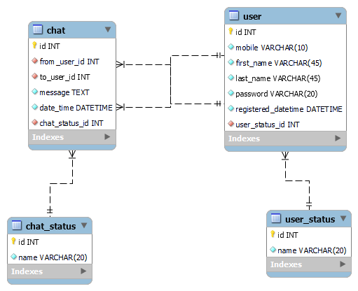

# Chatterwave - API Server (Java)

<p align="center">
  
  
  
</p>

This is the backend server for the **Chatterwave** chat application. It's built on the Java EE 7 platform and provides a complete RESTful API for all application functionalities, including user management, authentication, and messaging.

⬅️ **View Frontend Repository:** [**Chatterwave-Frontend (React Native)**](https://github.com/manujayagunathilaka/ChatterWave-Front-End)

<br/>

## Database Schema

The application uses a MySQL 8 database named `chatterwave`. The relational schema is designed to efficiently manage users, chats, and their statuses.



<br/>

## Key Features

* **RESTful API:** A well-defined API for all client-server communication.
* **User Management:** Handles user registration, login, profile data, and status updates.
* **User Status Management:** Tracks and manages user online/offline statuses in real-time.
* **Messaging Service:** Manages sending, receiving, and retrieving chat messages between users.
* **ORM Integration:** Uses Hibernate for efficient and reliable database operations.
* **JSON Serialization:** Utilizes the Gson library for robust JSON handling.

<br/>

## Technology Stack

* **Language/Platform:** Java (Java EE 7)
* **Application Server:** GlassFish
* **Database:** MySQL 8
* **ORM:** Hibernate
* **JSON Library:** Gson
* **Build Tool:** Apache Maven

<br/>

## Getting Started

Follow these instructions to set up and run the backend server on your local machine.


### Prerequisites

* JDK (Java Development Kit) 8 or higher
* Apache Maven
* GlassFish Server
* MySQL 8 Server


### Installation & Setup

1.  **Clone the Repository:**
    ```bash
    git clone [https://github.com/your-username/Chatterwave-Backend.git](https://github.com/your-username/Chatterwave-Backend.git)
    cd Chatterwave-Backend
    ```

2.  **Database Setup:**
    * Ensure your MySQL server is running.
    * Create a new database with the name `chatterwave`.
    * Open the Hibernate configuration file (`hibernate.cfg.xml` or `persistence.xml`) and update the database connection details (URL, username, password) to match your local MySQL setup.

3.  **Build the Project:**
    Use Maven to compile the source code and package it into a `.war` file.
    ```bash
    mvn clean install
    ```

4.  **Deploy to GlassFish:**
    * Start your GlassFish server.
    * Locate the generated `.war` file inside the `target/` directory of your project.
    * Deploy this `.war` file to your GlassFish server using the admin console or by copying it to the `autodeploy` directory.

5.  **Expose with Ngrok:**
    To allow the mobile client to connect to your local server, you must expose it to the internet.
    *(This assumes your GlassFish server is running on the default port `8080`)*
    ```bash
    ngrok http 8080
    ```
    This will generate a public URL (e.g., `https://xxxx.ngrok-free.app`). This URL is what you will use in the frontend application's configuration.

<br/>

## License

This project is licensed under the [MIT License](./LICENSE.md). See the `LICENSE.md` file for details.
